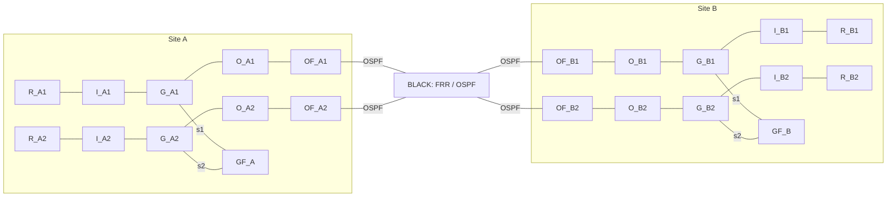

# Configurable MSC emulation for TDN experiments

The `tdn` branch extends `dev` with an explicit MSC appliance topology. Version 2
uses Twinet's existing FRR router runtime, private FRR control containers, OVS
switch renderer, and interactive access implementation. BLACK and Outer
Firewalls run OSPF. Gray Firewalls use FRR with declared fixed routes. Inner and
outer encryption appliances retain strongSwan and fixed crypto forwarding.

The prepared native deployment runs on **node-1**,
`clnode146.clemson.cloudlab.us`. The earlier Linux bridge deployment on node-0,
`clnode161.clemson.cloudlab.us`, remains at its earlier revision. Version 1 is
retained in `examples/msc/legacy.json`; its container names and runtime remain
compatible. Do not use the version 2 manifest to operate the node-0 deployment.

## Current topology on node-1

Node-1 runs the default two-site, two-level topology from
[msc.json](../examples/msc/msc.json). On 2026-09-27, the deployed manifest at
`/var/lib/twinet/msc/spec.json` matched that file, and all 42 containers were
running. The deployment has 35 logical devices, 44 veth links, and seven private
FRR control containers. The control containers share their device's network
namespace and do not add logical nodes or cables.

The deployed layout uses two Outer Firewalls and one Gray Firewall per site,
with a separate Gray switch for each security level. Its generator config is
[layouts/default.json](../examples/msc/layouts/default.json):

```json
{
  "name": "msc",
  "levels": 2,
  "outer_firewalls": 2,
  "gray_firewalls": 1,
  "shared_gray": false
}
```

The data topology below contains 23 devices and 24 physical links. Every solid
line represents a cable, including the Gray Firewall attachments. `GF_A` and
`GF_B` block forwarding between their S1 and S2 segments. Same-level traffic
passes directly between the inner and outer encryptors through its Gray switch.



The device inventory includes six separate management networks in addition to
the data topology:

| Role | Device IDs | Count |
|---|---|---:|
| Black transport router | `BLACK` | 1 |
| Outer Firewalls | `OF_A1`, `OF_A2`, `OF_B1`, `OF_B2` | 4 |
| Gray Firewalls | `GF_A`, `GF_B` | 2 |
| Red hosts | `R_A1`, `R_A2`, `R_B1`, `R_B2` | 4 |
| Inner encryptors | `I_A1`, `I_A2`, `I_B1`, `I_B2` | 4 |
| Outer encryptors | `O_A1`, `O_A2`, `O_B1`, `O_B2` | 4 |
| Gray OVS switches | `G_A1`, `G_A2`, `G_B1`, `G_B2` | 4 |
| Management OVS switches | `M_A1`, `M_A2`, `M_A99`, `M_B1`, `M_B2`, `M_B99` | 6 |
| Admin workstations | `AW_A1`, `AW_A2`, `AW_A99`, `AW_B1`, `AW_B2`, `AW_B99` | 6 |

Red and Gray addresses are assigned per site and security level. All addresses
in the following table use `/24`; each Gray Firewall has one interface in each
of its site's Gray subnets.

| Site / level | Red host | Inner Red interface | Inner Gray interface | Outer Gray interface | Gray Firewall interface |
|---|---|---|---|---|---|
| A / S1 | `R_A1: 10.1.1.10` | `I_A1: 10.1.1.1` | `I_A1: 10.100.1.2` | `O_A1: 10.100.1.1` | `GF_A/s1: 10.100.1.254` |
| A / S2 | `R_A2: 10.1.2.10` | `I_A2: 10.1.2.1` | `I_A2: 10.100.2.2` | `O_A2: 10.100.2.1` | `GF_A/s2: 10.100.2.254` |
| B / S1 | `R_B1: 10.2.1.10` | `I_B1: 10.2.1.1` | `I_B1: 10.200.1.2` | `O_B1: 10.200.1.1` | `GF_B/s1: 10.200.1.254` |
| B / S2 | `R_B2: 10.2.2.10` | `I_B2: 10.2.2.1` | `I_B2: 10.200.2.2` | `O_B2: 10.200.2.1` | `GF_B/s2: 10.200.2.254` |

Each outer encryptor connects to its Outer Firewall over a dedicated `/30`.
Each Outer Firewall has another `/30` link to BLACK. OSPF runs only on the
firewall-to-BLACK links and advertises the outer-encryptor subnets as passive
networks.

| Outer encryptor / Black address | Outer Firewall / inside address | Outer Firewall / outside address | BLACK port / address |
|---|---|---|---|
| `O_A1: 172.20.11.1/30` | `OF_A1: 172.20.11.2/30` | `OF_A1: 172.21.11.1/30` | `p11: 172.21.11.2/30` |
| `O_A2: 172.20.12.1/30` | `OF_A2: 172.20.12.2/30` | `OF_A2: 172.21.12.1/30` | `p12: 172.21.12.2/30` |
| `O_B1: 172.20.21.1/30` | `OF_B1: 172.20.21.2/30` | `OF_B1: 172.21.21.1/30` | `p21: 172.21.21.2/30` |
| `O_B2: 172.20.22.1/30` | `OF_B2: 172.20.22.2/30` | `OF_B2: 172.21.22.1/30` | `p22: 172.21.22.2/30` |

Management adds 12 devices and 20 links. Each admin workstation and every
listed appliance connect directly to that row's OVS switch. Appliance suffixes
such as `.20` refer to addresses in the listed subnet. Management links remain
separate from the Red, Gray, and Black data paths.

| Domain | Admin workstation / address | OVS switch | Subnet | Appliance management addresses |
|---|---|---|---|---|
| A / S1 | `AW_A1: 172.30.11.10` | `M_A1` | `172.30.11.0/24` | `I_A1: .20` |
| A / S2 | `AW_A2: 172.30.12.10` | `M_A2` | `172.30.12.0/24` | `I_A2: .20` |
| A / outer and firewalls | `AW_A99: 172.30.109.10` | `M_A99` | `172.30.109.0/24` | `GF_A: .20`, `O_A1: .21`, `O_A2: .22`, `OF_A1: .23`, `OF_A2: .24` |
| B / S1 | `AW_B1: 172.30.21.10` | `M_B1` | `172.30.21.0/24` | `I_B1: .20` |
| B / S2 | `AW_B2: 172.30.22.10` | `M_B2` | `172.30.22.0/24` | `I_B2: .20` |
| B / outer and firewalls | `AW_B99: 172.30.119.10` | `M_B99` | `172.30.119.0/24` | `GF_B: .20`, `O_B1: .21`, `O_B2: .22`, `OF_B1: .23`, `OF_B2: .24` |

Four logical IPsec tunnels protect the two levels across sites. Inner peers are
`I_A1` to `I_B1` and `I_A2` to `I_B2`; outer peers are `O_A1` to `O_B1` and
`O_A2` to `O_B2`. S1 and S2 share BLACK, but retain distinct Red subnets, Gray
segments, inner trust domains, and tunnel policies. The shared-Gray layouts
described below are supported alternatives; they are not the current node-1
deployment.

## Firewall and encryption implementation

The security stack combines FRR routing, Linux Netfilter packet filtering, and
strongSwan IPsec. Each logical device has its own network namespace, interfaces,
routing table, firewall rules, and IPsec state where applicable. All containers
share the worker's Linux kernel.

| Device | Routing or switching | Security enforcement |
|---|---|---|
| Outer Firewalls, `OF_*` | FRR with OSPF toward BLACK | Netfilter permits declared outer-encryptor peer traffic |
| Gray Firewalls, `GF_*` | FRR with connected and declared static routes | Netfilter separates security levels and filters shared-Gray paths |
| Encryptors, `I_*` and `O_*` | Fixed routes | strongSwan and Linux XFRM encrypt packets; Netfilter requires IPsec protection |
| Gray switches, `G_*` | OVS | Connect the declared segments; the firewall appliances enforce security policy |

### Firewall enforcement

Twinet generates firewall rules from the manifest and loads them with
`iptables-restore`. The verified node-1 appliances use `iptables` with the
`nf_tables` backend. FRR's `vtysh` manages routing; operators inspect and change
the packet filters with `iptables`. OVS provides switching through `ovs-vsctl`
and `ovs-ofctl`.

Security appliances begin with `INPUT DROP` and `FORWARD DROP`, then permit
specific traffic. Locally generated traffic uses `OUTPUT ACCEPT`. Twinet
disables forwarding while it prepares devices and installs filters before
enabling data forwarding. The rules come from
[`filterRules`](../internal/msc/render.go); the deployment sequence is in
[`engine.go`](../internal/msc/engine.go).

Outer Firewalls permit only the declared outer-encryptor endpoint pairs on the
expected interfaces. For example, `OF_A1` permits `172.20.11.1` to communicate
with `172.20.21.1` using ESP or UDP destination ports 500 and 4500. Reverse rules
permit the corresponding return traffic. Separate input rules admit OSPF from
the adjacent BLACK router and management traffic from the designated admin.
The firewall checks headers and protocols without decrypting ESP payloads.

Gray Firewalls block cross-level forwarding in the default layout. Each level
has a separate OVS switch, so same-level inner-to-outer traffic stays within
that segment. Routed attempts to reach another level pass through `GF_A` or
`GF_B` and meet the default DROP policy. The default Gray Firewall has no
forwarding accept rules.

Shared-Gray layouts place the Gray Firewall inline between each inner encryptor
and the common OVS fabric. Generated rules permit only ESP and IKE traffic
between that inner encryptor and its declared remote peer. Cross-level traffic
remains blocked. Sharing an Outer Firewall similarly adds a distinct inside
interface and peer-specific rules for each attached outer encryptor.

Management access uses both packet filtering and TLS authentication. An
appliance admits ICMP and TCP port 8443 only from its designated admin address
on the management interface. The HTTPS health endpoint requires a trusted
client certificate and TLS 1.3. The endpoint demonstrates management
authentication; interactive device access uses worker SSH followed by
`msc console` or `docker exec`.

### Two layers of IPsec encryption

strongSwan's `charon` daemon authenticates peers and negotiates keys through
IKEv2. Its `kernel-netlink` plugin installs security associations and policies
into Linux XFRM, which encrypts and decrypts the actual data packets. `swanctl`
loads the generated configuration and exposes live tunnel state. The image
configuration is in [images/msc/Dockerfile](../images/msc/Dockerfile).

Inner tunnels protect the Red subnets for one security level. For S1,
`I_A1` and `I_B1` use Gray endpoints `10.100.1.2` and `10.200.1.2`; their traffic
selectors are `10.1.1.0/24` and `10.2.1.0/24`. Outer tunnels protect traffic
between those inner endpoints. `O_A1` and `O_B1` use Black endpoints
`172.20.11.1` and `172.20.21.1`, with selectors `10.100.1.2/32` and
`10.200.1.2/32`. The encryptors use explicit routes, and strongSwan's automatic
route installation is disabled.

A packet from `R_A1` to `R_B1` gains one encryption layer at each encryptor.
Braces in the following notation denote encrypted and authenticated contents:

```text
Red, before I_A1:
  IP 10.1.1.10 -> 10.2.1.10 | original payload

Gray, after I_A1:
  IP 10.100.1.2 -> 10.200.1.2 | ESP_inner{original Red packet}

Black, after O_A1:
  IP 172.20.11.1 -> 172.20.21.1 | ESP_outer{entire Gray packet}
```

`O_B1` removes the outer layer and forwards the remaining inner ciphertext.
`I_B1` removes the inner layer and delivers the original packet to `R_B1`.
Outer encryptors handle inner ciphertext and do not receive the Red plaintext.
Twinet establishes outer tunnels first so they can carry the inner tunnels'
IKE exchanges. Permitted IKE and OSPF control packets remain distinct from the
nested ESP data traffic.

Both layers use AES-256-GCM with a 128-bit authentication tag. The configured
IKE proposal is `aes256gcm16-prfsha384-ecp384`; the ESP proposal is
`aes256gcm16-ecp384`. IKE uses a SHA-384-based pseudorandom function and ECP-384
key exchange. CHILD SAs have a configured rekey time of 50 minutes and lifetime
of one hour; IKE reauthentication is configured for three hours. The settings
are generated by [`swanConfig`](../internal/msc/render.go), and the algorithm
names follow [strongSwan's proposal definitions](https://docs.strongswan.org/docs/latest/config/proposals.html).

Certificates restrict tunnel establishment to the expected peer identities.
Twinet generates ECDSA P-384 keys and certificates, and each connection names a
specific remote identity such as `I_B1.msc.test`. S1 and S2 use separate inner
trust domains, `inner-s1` and `inner-s2`. The outer layer uses its own `outer`
trust domain. Strict certificate-revocation checking is enabled. CA private
keys stay in the worker's private state directory; each encryptor receives its
own credentials, trust anchor, and CRL. Certificate generation and renewal are
implemented in [`pki.go`](../internal/msc/pki.go).

### Requiring encryption before forwarding

Encryptor firewall rules require the packet to match the correct IPsec tunnel
policy as well as its interfaces and traffic selectors. For example, the S1
inner encryptor's outbound rule requires:

```text
input interface:  red
output interface: gray
source:           10.1.1.0/24
destination:      10.2.1.0/24
IPsec match:      --dir out --pol ipsec --mode tunnel --reqid 101
```

The reverse rule requires an inbound IPsec policy match before forwarding to
Red. Outer encryptors apply the same mechanism with their outer tunnel policy,
such as `reqid 201`, and additionally restrict tunnel payloads to inner ESP or
IKE traffic. Arbitrary Gray plaintext does not match those forwarding rules.

Missing encryption state does not authorize plaintext fallback. If a required
SA is absent while its policy remains, XFRM requires tunnel establishment rather
than forwarding the protected packet in cleartext. If both the SA and policy
are removed, the firewall's IPsec match fails and the default DROP policy
applies. Encryptors have no blanket `ESTABLISHED,RELATED` forwarding exemption
that would bypass the IPsec requirement. The failure suite explicitly removes
both SAs and policies and checks for blocked delivery and visible Red plaintext.

The two encryption layers have separate keys, certificates, processes, and
network namespaces. Both layers use the same strongSwan implementation and
share the worker kernel. Their separation models layered network protection;
it does not provide independent hardware or vendor implementations.

## Log in and use native device commands

Run the following commands on node-1:

```sh
ssh hy@clnode146.clemson.cloudlab.us
cd ~/Twinet
sudo bin/twinet msc console BLACK
```

FRR routers open `vtysh`. BLACK, `OF_A1`, and `GF_A` provide normal FRR commands:

```text
show running-config
show ip route
show ip ospf neighbor
configure terminal
router ospf
passive-interface p11
end
```

That last example deliberately breaks one BLACK adjacency. Configuration
changes affect the running network and persist until reconciliation or restart.
Use another terminal to inspect the effect, then restore the declared baseline:

```sh
sudo bin/twinet msc check > /tmp/msc-check.json
sudo bin/twinet msc recover
```

Switches open Bash with the native OVS tools. OVS has `ovs-vsctl` and `ovs-ofctl`,
rather than a Cisco-style command interpreter:

```sh
sudo bin/twinet msc console G_A1
ovs-vsctl show
ovs-ofctl dump-flows br0
ovs-ofctl add-flow br0 'priority=100,actions=drop'
exit
sudo bin/twinet msc recover
```

The container names are the device IDs, such as `BLACK`, `OF_A1`, `G_A1`, and
`I_A1`. They have no `twinet-msc-` prefix. FRR's private daemon containers add only
`-frr`, such as `BLACK-frr`. Use the device container for CLI access. The control
container carries FRR's extra startup capabilities and is an internal component.

```sh
sudo docker exec -it OF_A1 vtysh
sudo docker exec -it G_A1 bash
sudo bin/twinet msc console BLACK -- bash
sudo bin/twinet msc exec BLACK -- vtysh -c 'show ip route ospf'
sudo docker exec I_A1 swanctl --list-sas
```

`console --no-tty DEVICE -- COMMAND` supports streamed automation. `exec` is the
batch interface. A console can remain open while another terminal runs checks.
There is no per-device SSH daemon; SSH authenticates to the worker first.

## Choose a layout

A small JSON config controls generation. Counts are **per site**. The generator
supports two sites, one to eight security levels, and one to `levels` Outer
Firewalls and Gray Firewalls per site:

```json
{
  "name": "msc",
  "levels": 2,
  "outer_firewalls": 1,
  "gray_firewalls": 1,
  "shared_gray": true
}
```

Generate an explicit manifest before deployment. Explicit CLI flags override
values in the small config file:

```sh
bin/twinet msc init --config examples/msc/layouts/shared.json --spec /tmp/shared.json
bin/twinet msc plan --spec /tmp/shared.json
bin/twinet msc init --levels 4 --outer-firewalls 2 --gray-firewalls 2 \
  --shared-gray --spec /tmp/four-levels.json
```

`init` refuses to overwrite existing files. Edit the small config and generate a
new manifest when changing layout. The expanded manifest exposes every device,
address, route, tunnel, management domain, and cable. It can also be edited for
asymmetric site arrangements. `plan` validates structural consistency; `check`
measures live behavior and the modeled Gray firewall cuts.

Three ready-made layouts are supplied:

| Layout file | Outer Firewalls per site | Gray Firewalls per site | Gray data fabric |
|---|---:|---:|---|
| `layouts/default.json` | 2 | 1 | Separate per level |
| `layouts/shared.json` | 1 | 1 | Shared outer-side switch |
| `layouts/shared-two-gray.json` | 1 | 2 | Shared outer-side switch |

The default has 35 devices and 44 cables, plus seven private FRR control
containers. A level's data path is:

```text
R_An -- I_An -- G_An -- O_An -- OF_An -- BLACK -- OF_Bn -- O_Bn -- G_Bn -- I_Bn -- R_Bn
```

A shared Outer Firewall connects several outer encryptors through distinct
inside interfaces. Its filters allow each encryptor's configured remote peer.
OSPF advertises the outer endpoint subnets over BLACK; management, Red, and Gray
prefixes are excluded. Startup waits for the required routes in both FRR and the
kernel forwarding table, as well as Full neighbor adjacencies. Outer encryptors never run OSPF or BGP.

A shared Gray layout places each inner encryptor behind a Gray Firewall before
the common OVS switch:

```text
I_A1 -- GF_A -- G_A -- O_A1 -- OF_A1 -- BLACK
I_A2 -- GF_A -- G_A -- O_A2 -- OF_A1 -- BLACK
```

With two Gray Firewalls, `I_A1` attaches to `GF_A1` and `I_A2` to `GF_A2`.
Each firewall connects to `G_A`. Every physical cross-level Gray path still
crosses a firewall. The common switch does not directly bridge the inner
interfaces. Gray filters allow only IKE/ESP between the declared same-level
inner peers. Dedicated layouts attach every Gray Firewall to each level's
separate switch. Multiple firewalls model alternative paths; automatic HA or
failover is not configured.

Layout changes require `down` with the **old manifest**, followed by `up` with
the new manifest. Bare names mean manifests with overlapping device IDs cannot
run simultaneously on one worker, even with different lab names. Ownership
labels prevent removal or reuse of another lab's containers.

```sh
sudo bin/twinet msc down
sudo bin/twinet msc up --spec /tmp/shared.json
sudo bin/twinet msc check --spec /tmp/shared.json > /tmp/shared-check.json
```

## Export configurations and live facts

`export` creates a versioned evidence bundle for later TDN theory construction:

```sh
sudo bin/twinet msc export --output /tmp/msc-snapshot-001
sudo bin/twinet msc status > /tmp/msc-status.json
sudo bin/twinet msc check > /tmp/msc-check.json
```

The export destination must be new. The bundle contains:

| File | Meaning |
|---|---|
| `manifest.json` | Schema version, source build identity, observation interval, spec hash, and SHA-256 for every other file |
| `spec.json` | Declared topology, interfaces, roles, zones, routes, tunnel endpoints, and image references |
| `status.json` | Raw sampled device observations, image IDs, timestamps, and observation errors |
| `facts.json` | The same observations with JSON outputs decoded into objects and arrays |
| `devices/ID/declared.json` | That device's declared model |
| `devices/ID/intended.*` | Generated FRR, OVS, firewall, or strongSwan configuration |
| `devices/ID/observed.*` | Live FRR and firewall configuration where available |

Live facts include kernel interfaces/routes/rules, FRR running configurations,
OSPF neighbors and routes, OVS port/VLAN state and OpenFlow rules, software
versions, redacted XFRM state, SA status, and public certificate information.
The exporter never copies private keys, credential stores, or the private state
directory. Intended and observed values remain separate, including during a
misconfiguration. Missing or failed observations carry explicit errors and must
be treated as unknown facts.

Each device records its deployed specification hash separately from the chosen
manifest. Editing a manifest does not relabel the running deployment, and `check`
rejects a mismatch.

The snapshot is sampled sequentially, not atomically. Export does not run active
probes or certify an invariant. Save `msc check` output separately when packet
or reachability evidence is needed. `manifest.json` is written last; an export
without that file is incomplete. No TDN or Lean adapter is implemented yet.

## Verify and recover

`check` verifies device state, native configuration drift, OSPF adjacencies and
routes, permitted same-level traffic, cross-level isolation, Gray firewall cuts,
management TLS authentication, and ESP carriage without observed Red plaintext.

```sh
sudo bin/twinet msc check > /tmp/check.json
jq '{passed, checks: (.checks | length)}' /tmp/check.json
sudo bin/twinet msc test-failures > /tmp/failures.json
sudo bin/twinet msc test-failures --native-only > /tmp/native-failures.json
sudo bin/twinet msc restart BLACK
sudo bin/twinet msc restart G_A1
```

`test-failures` exercises SA/policy loss, wrong peer identity, revocation,
encryptor restart, an OSPF CLI mistake, an OVS drop rule, and native router/switch
restart. It restores the baseline between scenarios. The demonstration requires
the generated two-site layout with at least two levels. `check`, `status`, and
`export` operate from the explicit topology rather than a fixed appliance count.

Manual injected faults remain available:

```sh
sudo bin/twinet msc fault ipsec-down O_A1
sudo bin/twinet msc recover
sudo bin/twinet msc fault firewall-open GF_A
sudo bin/twinet msc check > /tmp/drift.json
sudo bin/twinet msc recover
```

`up` creates missing devices and reapplies the baseline. `recover` also resets
IPsec state, renews leaf certificates, and clears recorded faults. Both commands
interrupt forwarding during configuration. They deliberately replace native CLI
experiments with the declared configuration. Export experiments before recovery
if their state should be retained.

## Install or rebuild

The worker needs Linux namespaces, veth, XFRM, iptables policy matching, the OVS
kernel module, Docker, and the Go toolchain declared in `go.mod`:

```sh
sudo apt-get update
sudo apt-get install -y docker.io golang-go iproute2 jq tcpdump
sudo systemctl enable --now docker
sudo modprobe openvswitch
sudo modprobe xfrm_user
sudo modprobe af_key
sudo modprobe xt_policy
git clone --branch tdn https://github.com/HongyuHe/Twinet.git
cd Twinet
go build -o bin/twinet ./cmd/twinet
for image in $(jq -r '.image,.router_image,.switch_image' examples/msc/msc.json); do
  sudo docker pull "$image"
done
sudo bin/twinet msc up
```

Published images are `hyhe/twinet-msc`, `hyhe/twinet-msc-router`, and
`hyhe/twinet-msc-switch`. The manifests pin tested digests. Native image sources
extend `images/router` and `images/switch` with tools for observation and TLS
management. They retain those images' entrypoints and networking software.

To rebuild on a Linux worker with Docker access:

```sh
bash examples/msc/build-native-images.sh
```

The script builds the original router helper binaries and base images first.
Use local tags in a separate manifest for a new image build. A changed image or
manifest requires an explicit `down`/`up`; running containers are never silently
adopted under a different image identity.

## State and scope

Private state defaults to `/var/lib/twinet/msc`. It stores CA keys, leaf
credentials, CRLs, expected configurations, and active faults. CA private keys
remain outside containers. Separate inner trust domains protect each security
level; the outer layer has its own trust domain. Management uses separate
per-site/per-domain TLS 1.3 client authentication.

A host reboot stops the lab. Run `msc up` after Docker starts to restore links,
filters, native configuration, and tunnels. `down` removes owned devices and
FRR control containers while retaining PKI state. Use `--spec` and `--state-dir`
consistently for nondefault deployments. Certificates last one month and CRLs
seven days; `up` refreshes CRLs and `recover` renews leaf certificates.

The profile runs on one worker. It shares the worker kernel and does not use
Twinet's distributed AS placement or automatic HA. The prototype models network
behavior; it does not establish CSfC product approval, hardware diversity,
physical protection, or full package compliance. The historical node-0 results
remain in `examples/msc/VALIDATION.md`; native results are recorded in
[VALIDATION_NATIVE.md](../examples/msc/VALIDATION_NATIVE.md).
